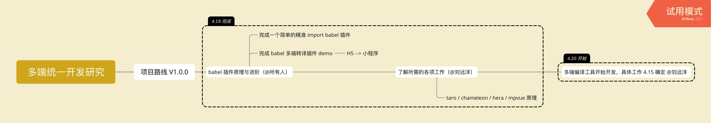

# 多端统一开发研究

## 简介

该项目致力于多端统一框架研究，包括但不限于：现有的 taro / chameleon 等多端框架原理理解、自研一套完整的多端框架、各种分析文章等。

以下为该研究项目的各项安排。

## 项目拆分思维导图

## 阶段任务拆解

+   深入 babel 插件开发
    +   完成文章 [深入Babel，这一篇就够了](https://juejin.im/post/5c21b584e51d4548ac6f6c99) “Babel插件实践” 部分的实践。

        https://github.com/hoperyy/water/issues/1

## 分享产出

To Do

## 参考资料

+   [Babel 插件手册](https://github.com/jamiebuilds/babel-handbook/blob/master/translations/zh-Hans/plugin-handbook.md)
+   [深入Babel，这一篇就够了](https://juejin.im/post/5c21b584e51d4548ac6f6c99)
+   [小程序框架对比](https://mina.wiki/eco/framework.html)
+   [taro 原理总结](https://www.jishuwen.com/d/2xm1)