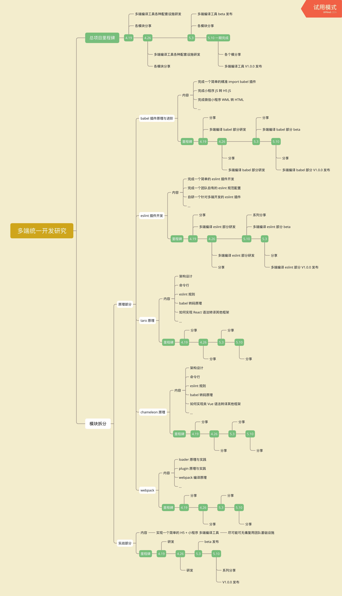

# 多端统一开发研究

## 简介

该项目致力于多端统一框架研究，包括但不限于：现有的 taro / chameleon 等多端框架原理理解、自研一套完整的多端框架、各种分析文章等

下图为该研究项目的各项安排：

## 分享产出

To Do

## 参考资料

+   [小程序框架对比](https://mina.wiki/eco/framework.html)
+   [taro 原理总结](https://www.jishuwen.com/d/2xm1)